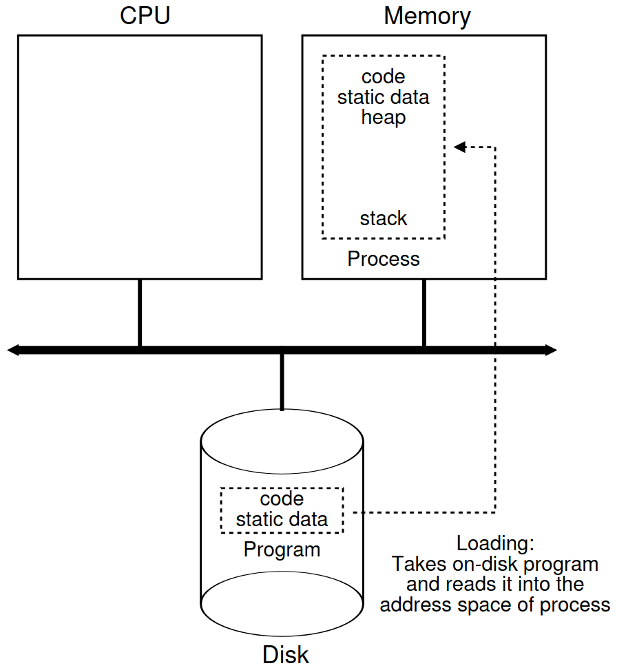
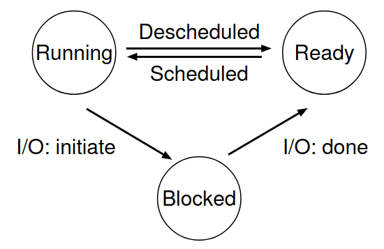

# **Processi**

Matteo Dell'Amico

<a href="https://creativecommons.org/licenses/by-sa/4.0/"></a> [CC BY-SA 4.0](https://creativecommons.org/licenses/by-sa/4.0/)

Sorgenti [Marp](https://marp.app/) su https://github.com/matteodellamico/os_slides

Fonte: [*The Abstraction: The Process*](https://pages.cs.wisc.edu/~remzi/OSTEP/cpu-intro.pdf), capitolo 4 di [*Operating Systems: Three Easy Pieces*](http://pages.cs.wisc.edu/~remzi/OSTEP/), di Remzi H. Arpaci-Dusseau e Andrea C. Arpaci-Dusseau. I diagrammi in queste slide vengono da questo capitolo.

---

# Cos'è un processo?

Un programma è solo un file su disco.

Un processo è un **programma in esecuzione**. Il sistema operativo **dà vita** ai programmi, rendendoli utili.

---

# L'illusione delle CPU infinite


Vogliamo eseguire molti programmi contemporaneamente, ma abbiamo **un numero limitato di CPU** (per molto tempo i computer ne avevano una sola).

Come possiamo dare a ogni programma **l'illusione di avere a disposizione una CPU tutta per sé?**

---

# Time sharing


Idea chiave: **virtualizzare** la CPU, condividendola.

Il SO alterna l'esecuzione dei programmi, assegnando a ognuno una piccola frazione di tempo (*time slice*).

Il time sharing, come lo **space sharing** (esempio: dischi), è una delle idee chiave per virtualizzare le risorse.

Viene implementato tramite **meccanismi** di basso livello (es.: *context switch*) e **politiche** (*policy*) di alto livello (es.: *scheduling*).

---

# Cos'è un processo, per il SO?

Il suo **stato**: ciò che può cambiare mentre si esegue.

- **Memoria**: spazio di indirizzamento (istruzioni + dati)
- **Registri**: stato della CPU, inclusi
    - *program counter* (PC)
    - *stack pointer* (SP)
    - *frame pointer* (FP)
- **Risorse aperte**: ad esempio, file

Lo stato viene salvato quando il processo viene interrotto e ricaricato quando riprende l'esecuzione.

---

# Interfaccia per i processi

- **Creazione**: un processo può crearne altri (comando nella shell, doppio click...)
- **Terminazione**: alcuni processi potrebbero non terminare, per cui vogliamo "ucciderli" (es.: `kill` in Linux)
- **Wait**: un processo può aspettare che un altro termini
- **Altri controlli**: sospensione, ripresa, priorità...

---

# Creazione di processi



Codice e dati vengono **copiati in memoria**
- nei SO recenti, in modo "pigro" (*lazy*): solo quando serve (lo vedremo!)

Si alloca memoria per **stack** e **heap**

Si impostano `argc`, `argv`, descrittori di file (standard input/output/error)

Si impostano le strutture dati del kernel

Si avvia il processo nel suo entry point (`main()` in C)

---

# Stato di un processo



- **Pronto** (*ready*): può essere eseguito appena la CPU è libera
- **In esecuzione** (*running*): sta usando la CPU
- **Bloccato** (*blocked*): non può proseguire finché non succede qualcosa (es.: attesa di I/O)

Ci sono altri stati, ma questi sono i principali

<!-- Esempio di esecuzione: due processi di fila, in un caso uno fa I/O -->

---

# Nodo della lista processi (OS didattico xv6)

```c
// the registers xv6 will save and restore to stop and subsequently restart a process
struct context {
    int eip, esp, ebx, ecx, edx, esi, edi, ebp;
};

// the different states a process can be in
enum proc_state { UNUSED, EMBRYO, SLEEPING, RUNNABLE, RUNNING, ZOMBIE };

// the information xv6 tracks about each process including its register context and state
struct proc {
    char *mem; // Start of process memory
    uint sz; // Size of process memory
    char *kstack; // Bottom of kernel stack for this process
    enum proc_state state; // Process state
    int pid; // Process ID
    struct proc *parent; // Parent process
    void *chan; // If !zero, sleeping on chan
    int killed; // If !zero, has been killed
    struct file *ofile[NOFILE]; // Open files
    struct inode *cwd; // Current directory
    struct context context; // Switch here to run process
    struct trapframe *tf; // Trap frame for the current interrupt
};
```