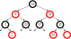

# Fair scheduling

Matteo Dell'Amico

 [CC-BY-SA 4.0](https://creativecommons.org/licenses/by-sa/4.0/)

Sorgenti [Marp](https://marp.app/) su https://github.com/matteodellamico/os_slides

Fonte: [*Scheduling: Proportional Share*](https://pages.cs.wisc.edu/~remzi/OSTEP/cpu-sched-lottery.pdf), capitolo 9 di [*Operating Systems: Three Easy Pieces*](http://pages.cs.wisc.edu/~remzi/OSTEP/), di Remzi H. Arpaci-Dusseau e Andrea C. Arpaci-Dusseau.

---

# Scheduling "equo"

Il concetto di "equo" non è universale:
- "first come first serve" (FIFO)
- condivisione equa della CPU
    - tra processi
    - tra utenti
    - tra gruppi di utenti
- non necessariamente *uguale* per tutti

Per noi: **condivisione proporzionale** secondo **pesi assegnati**.

<!--
# Non va bene Round Robin?

**No.**

RR non permette **priorità diverse** a **processi diversi**.

Inoltre, RR è equo solo tra processi **CPU-bound**.

Un processo **interattivo** che fa spesso I/O ottiene CPU solo quando (raramente) è pronto.
-->

---

# Lottery scheduling

A ogni utente vengono assegnati **biglietti**, che possono venire suddivisi tra i suoi processi.

A ogni time slice, viene estratto un **biglietto a caso**, e la CPU viene assegnata al **processo che lo possiede**.

Implementazione: facile, con una lista linkata

---

# Lottery: fairness

Alla lunga, la **frazione di CPU** e quella di **biglietti** saranno vicini

Esempio: con due job della stessa durata, possiamo definire una semplice **metrica di fairness** $F$:

$$F = \frac{\text{tempo di completamento del primo job}}{\text{tempo di completamento del secondo job}}$$

Resta il problema di **come dividere i biglietti** tra utenti e processi.

---

<!-- alla lavagna: esempio di scheduling -->

# Stride scheduling

Ogni processo ha uno **stride** (falcata) pari a un valore $M$ diviso per il numero di biglietti, e un contatore **pass** che parte da zero.

Per esempio, con $M=10.000$:

| Processo | Biglietti | Stride |
| -------- | --------- | ------ |
| A        | 100       | 100    |
| B        | 50        | 200    |
| C        | 40        | 250    |

---

# Stride: come funziona

Viene sempre schedulato il processo con il valore **pass** più basso.

Quando viene eseguito, il suo **pass** viene incrementato del suo **stride**.

Poiché viene sempre scelto il processo più "indietro" (con pass più basso), alla lunga la frazione di CPU e quella di biglietti saranno vicini.

---

# Stride o lottery?

Soluzioni con comportamento simile.

Premiando il processo più indietro, stride è **più equo**.

Come gestire i nuovi processi?
* Con lottery, basta dargli dei biglietti.
* Con stride, bisogna complicare leggermente l'algoritmo.
  * es.: dando al nuovo processo il valore di pass minimo

---

# Completely Fair Scheduler (CFS)

Usato in Linux dal 2007 al 2023.

Idea: in una finestra di tempo `sched_latency` (default: 48 ms), ogni processo dovrebbe ricevere una fetta di CPU proporzionale al suo peso.

Per ora, consideriamo solo processi con lo stesso peso.

---

# CFS: esempio

Quando C e D terminano, i timeslice diventano più lunghi.

---

# CFS: come funziona

Un contatore `vruntime` (tempo di esecuzione virtuale) tiene traccia del tempo di CPU ricevuto da ogni processo.

Si esegue il processo $k$ con `vruntime` più basso, e se ci sono $n$ processi gli si assegna una time slice $t_k$:

$$t_k = \frac{\texttt{sched\_latency}}{n}$$

Per evitare time slice troppo piccole, c'è un valore minimo `min_granularity` (default: 6 ms).

Linux è *tickless*: il timer interrompe il processo in esecuzione **solo quando scade la sua time slice**.

---

# CFS: pesi (niceness)

I pesi vengono stabiliti tramite il comando `nice`.  Per motivi storici, i valori vanno da -20 (peso $w_{-20}=88761$) a +19 ($w_{19}=15$).

Dobbiamo adattare la formula della time slice:
$$t_k = \frac{w_k}{\sum_{i=1}^{n} w_i}\texttt{sched\_latency}$$

Aggiornamento di `vruntime`, se il processo ha peso $w_k$:
$$\texttt{vruntime} \leftarrow \texttt{vruntime} + \frac{w_0}{w_k}\texttt{runtime}_k$$

---

# CFS: implementazione

**Albero rosso-nero** (red-black tree) per tenere traccia dei processi pronti.

Binario, bilanciato, con tempo di inserimento, cancellazione e ricerca $O(\log n)$.

---

# CFS: processi bloccati

Quando un processo si blocca (I/O, sleep, ...), viene rimosso dall'albero.

Quando si risveglia, ottiene il valore di `vruntime` più basso nell'albero:
- viene servito subito
- se mantenesse il suo vecchio `vruntime`, terrebbe la CPU troppo a lungo

---

# In sintesi

Abbiamo visto politiche basate sul concetto di **proporzionalità**:
- **lottery scheduling**: semplice, ma con variabilità
- **stride scheduling**: più equo, ma leggermente più complesso
- **CFS**: usato in Linux, con pesi e implementazione efficiente

Queste politiche garantiscono **equità**, che è importante in molti scenari (es.: server condivisi/cloud).

Rispetto a MLFQ, questi approcci potrebbero essere **meno reattivi con processi interattivi**.