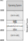
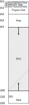

# Traduzione degli indirizzi

Matteo Dell'Amico

<a href="https://creativecommons.org/licenses/by-sa/4.0/"></a> [CC-BY-SA 4.0](https://creativecommons.org/licenses/by-sa/4.0/)

Sorgenti [Marp](https://marp.app/) disponibili a [questo link](https://github.com/matteodellamico/os_slides)

Fonte: [*Mechanism: Address Translation*](https://pages.cs.wisc.edu/~remzi/OSTEP/vm-mechanism.pdf), capitolo 14 di [*Operating Systems: Three Easy Pieces*](http://pages.cs.wisc.edu/~remzi/OSTEP/), di Remzi H. Arpaci-Dusseau e Andrea C. Arpaci-Dusseau.

---


# Un nuovo meccanismo

I meccanismi descrivono **come** fare le cose; sono le **politiche** a definire **cosa** fare.

Avevamo visto **esecuzione diretta limitata** e **context switch**.

Vediamo la **traduzione degli indirizzi**: come passare da memoria **virtuale** a memoria **fisica**.

Come visto in passato, l'hardware ci aiuta.

---

# Il problema: virtualizzare la memoria

Vogliamo che ogni processo abbia il suo **spazio di indirizzamento virtuale**, con questi requisiti:

- **Efficienza**: la traduzione deve essere veloce
- **Protezione**: un processo non deve poter accedere alla memoria di un altro processo
- **Flessibilità**: non mettere limiti a quel che un processo può fare

---


# Traduzione degli indirizzi

Grazie a questo meccanismo, l'hardware **traduce ogni accesso alla memoria** da indirizzo virtuale a indirizzo fisico:
- fetch di istruzione
- load
- store

Il SO **configura l'hardware** e **gestisce la memoria**, tenendo traccia di quali locazioni fisiche sono assegnate a ogni processo.

---

<!-- _class: design -->

# Design tip: interposizione

<a title="UlrichAAB, CC BY-SA 3.0 &lt;https://creativecommons.org/licenses/by-sa/3.0&gt;, via Wikimedia Commons" href="https://commons.wikimedia.org/wiki/File:Interceptor.VSD_Example.png"></a>


Potente tecnica generica per **inserire un livello di astrazione** tra due componenti.

Ci si piazza all'**interfaccia** tra i due componenti, e si **controlla** il flusso di informazioni.

Tecnica **trasparente**. Tra i casi d'uso: logging, sicurezza, caching, traduzione.

---



# Caso facile

Supponiamo che:
- ogni processo abbia un **blocco contiguo** di memoria fisica
- lo spazio di indirizzamento sia **più piccolo** della memoria fisica
- ogni spazio di indirizzamento abbia **la stessa dimensione**

Come fatto in precedenza, andremo verso casi via via più complessi e **realistici**.

---



# Esempio

```c
void func() {
    int x = 3000;
    x = x + 3;  // ci interessa questa linea
    ...
```

```asm
128: movl 0x0(%ebx), %eax ;load 0+ebx into eax
132: addl $0x03, %eax     ;add 3 to eax register
135: movl %eax, 0x0(%ebx) ;store eax back to mem
```

Quanti sono gli **accessi in memoria** per questa linea di codice?
* 5 (3 fetch + 2 load/store)

* Gli accessi siano moltissimi in codice realistico.

---

<!-- _class: aside -->

# ...ma farlo in software?

Un tempo esistevano tecniche di rilocazione in software, che andavano a modificare il codice delle istruzioni che si riferivano alla memoria, aggiungendo un **offset**.

Non c'era **protezione**: un processo poteva accedere a memoria fuori dal suo spazio.

Una volta piazzato, era complicato spostarlo in memoria.

---


# Rilocazione dinamica

Semplice sistema basato sull'hardware, anche chiamato *base and bounds*.

La CPU ha due registri:
- `base`, con l'indirizzo fisico di **inizio** del blocco del processo in esecuzione (qui, 32K=32768)
- `bounds` (o `limit`), con la **dimensione** del blocco

Un indirizzo fisico $a$ viene calcolato in base a quello virtuale come

$$a = \texttt{base} + v.$$

---

<!-- Traduzione degli indirizzi, fatta a runtime quindi dinamica. -->


# Esempio

Nell'istruzione

```asm
128: movl 0x0(%ebx), %eax
```

PC vale 128, e `ebx` vale 15K=15360.

* L'indirizzo fisico dell'istruzione è $32768 + 128 = 32896$.

* Quello del dato è $32768 + 15360 = 48128$ (47K).

---


# E il registro `bounds`?

Viene usato per la **protezione**.

Nel nostro esempio, `bounds` vale 16K=16384.

Ogni accesso alla memoria controlla che l'indirizzo virtuale $v$ sia minore di `bounds` (e non negativo).

In caso contrario, la CPU genera un errore *out of bounds*
* il processo viene terminato.

---

# Riassumendo, il supporto hardware

La CPU fornisce **supporto alla virtualizzazione** in vari modi.

- Modalità **kernel** e **utente** per permettere l'**esecuzione diretta limitata**.

- Una parte che gestisce la memoria virtuale (memory management unit, MMU) per la **traduzione degli indirizzi**.
  - Per ora `base` e `bounds`, vedremo meccanismi più complessi.

- Istruzioni **privilegiate** per impostare la MMU

- **Eccezioni** per gestire errori di protezione della memoria
  - istruzioni per impostare i relativi **gestori** (*handlers*).

---

<!-- esempio da figure 15.5 e 15.6 del libro -->

# Il lavoro del SO

**Trovare spazio fisico** per ogni processo.
- Con le supposizioni fatte, è facile: suddivisiamo la memoria in blocchi (*slot*) e ne scegliamo uno libero.
- Serve una **free list** per tenere traccia degli slot liberi.

Aggiornare la free list quando un processo termina.

**Impostare `base` e `bounds`** ad ogni context switch.
- La struttura dati *process control block* (PCB) salva questi valori per ogni processo.

**Gestire le eccezioni**, impostando i gestori all'avvio.

---

# Riassunto

Abbiamo visto il meccanismo di **traduzione degli indirizzi** per realizzare la memoria virtuale.

Il SO usa il supporto hardware per **tradurre ogni accesso alla memoria** da indirizzo virtuale a indirizzo fisico, garantendo **protezione**  in maniera **trasparente** ai processi.

Abbiamo visto la **rilocazione dinamica**, basata su due registri `base` e `bounds`. 
- **Veloce**, richiede **poche risorse hardware**
- Purtroppo, lo spazio inutilizzato viene **sprecato** (frammentazione interna)
